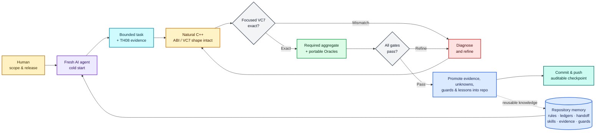

# 東方永夜抄 ～ Imperishable Night

<p align="center">
  
</p>

<p align="center">
  
</p>

> [!IMPORTANT]
> 🌙 The authored reconstruction is complete, and the Linux port is playable.
> Download [TH08 Reconstruction v0.2.0 — Native Linux 64-bit](https://github.com/N0zoM1z0/th08/releases/latest);
> active ELF64 source lives on
> [`port/portable-64bit`](https://github.com/N0zoM1z0/th08/tree/port/portable-64bit).
> Windows and macOS ports remain in progress.

## TL;DR

| I want to... | Start here |
| --- | --- |
| Check reconstruction progress | [Repository status](#repository-status) |
| Understand how AI agents work on the project | [AI agent workflow](#ai-agent-workflow) |
| Read our accuracy and readability philosophy | [What we mean by semantic reconstruction](#what-we-mean-by-semantic-reconstruction) |
| Contribute | [Contributing](#contributing) |
| Play or build a port | [Platform guides](#platform-guides) |
| Reproduce the native VC7 runtime gate | [Windows i386 reconstruction runtime](docs/WINDOWS_I386_RUNTIME.md) |
| Reproduce the exact comparison | [Exact reconstruction](#exact-reconstruction) |
| Find the production owner of a source symbol | [Source and build ownership map](docs/SOURCE_MAP.md) |
| Browse current subsystem semantics | [Current semantic index](docs/SEMANTIC_INDEX.md) |
| Browse the technical documentation | [Project map](#project-map) |
| Review upstream history and attribution | [Credits and provenance](#credits-and-provenance) |

## Repository status

This repository reconstructs the original Japanese
`東方永夜抄 ～ Imperishable Night` version 1.00d executable. Every one of the
1,107 authored functions now has source. Strict comparison currently accepts
1,106 of them, covering 459,396 of 459,757 authored bytes.

| Area | Status | Current position |
| --- | --- | --- |
| Authored source | **Complete** | 1,107 / 1,107 functions are present in source |
| Strict authored comparison | **99.92% by bytes** | 1,106 / 1,107 functions are accepted as exact |
| Whole executable | **In progress** | PE layout, linked runtime/library code, and one authored near match remain |
| Web | **Playable** | Public WebAssembly/WebGL 2 build |
| Linux | **Playable** | Native i386; x86_64/AArch64 work on `port/portable-64bit` |
| Windows | **In progress** | VC7 i386 prerequisite complete; modern redistributable packaging remains |
| macOS | **In progress** | Native backend and packaging are planned |

Exact reconstruction and playable ports are separate milestones. The progress
bar counts authored bytes accepted by strict comparison; the platform cards
show where the reconstructed source is currently playable.

The VC7-built Windows i386 reconstruction completed the prerequisite
whole-program runtime oracle before modern-port stabilization. It caught
production translation-unit, link, global-owner, static-initialization, and
lifetime defects which a modern compiler or compatibility startup path can
hide. Exact-facing checks use the native `normal` build; Windows playtesting
uses the equally native VC7 `bugfix` build because a reconstructed executable
cannot satisfy the retail executable-size/checksum whitelist. See the [native
reconstruction runtime workflow](docs/WINDOWS_I386_RUNTIME.md) and [runtime
issue ledger](docs/RUNTIME_ISSUES.md) for the reproducible gate and the defects
found by the completed pass. This developer artifact is not the future
redistributable Windows port.

The remaining exact-reconstruction work is the last authored near match,
whole-image layout, and the compiler/runtime and D3DX code linked into the
original game. The repository ledgers are the canonical source for live
counts.

## AI agent workflow

All new engineering in this continuation—reverse engineering, source matching,
semantic recovery, tooling, documentation, and porting—is carried out by AI
coding agents. The human maintainer sets the direction, decides what is
published or merged, and supplies the legally obtained target and game data.
The imported GensokyoClub history retains its original authorship and
contribution record.

Our premise in 2026 is that frontier coding agents can sustain native-code
reconstruction when they work with durable project memory, bounded tasks,
strong tools, and fast empirical feedback. Each agent contribution begins as a
testable hypothesis. The verified target and toolchain provide the verdict.

The most important design rule is simple: **the repository is the project's
shared memory.** Personal memory and chat sessions are temporary workspaces.
Durable knowledge, experience, and lessons belong in forms that the next
contributor can find, review, rerun, and improve: source, ledgers, focused
evidence notes, scripts, tests, guards, and reusable skills.



The “Oracle” in that diagram is a stack of reproducible checks. We pin the
exact Japanese 1.00d executable by size and SHA-256, compare the smallest
affected VC7 function or object, and verify relocations alongside instruction
bytes. A shared change then triggers a clean, single-job rebuild of every
configured comparison object and a replay of the whole accepted ledger.
Normal VC7 linking, modern Linux builds, fixed-layout checks, available runtime
tests, and repository CI cover different classes of regression. “Exact” is a
recorded, comparator-backed repository state.

Repository memory is part of the working architecture. Each durable result has
a canonical home:

- [AGENTS.md](AGENTS.md) holds the target, ABI, safety, and acceptance rules.
- The CSV/TOML ledgers and status scripts hold live mappings and accepted
  results; prose provides context for these canonical records.
- [The current handoff](docs/RE_HANDOFF.md) says what is complete, what is
  blocked, and what should happen next.
- [Task-specific skills](.agents/skills/) and
  [the knowledge map](docs/KNOWLEDGE_BASE.md) preserve tool recipes, VC7 source
  patterns, evidence boundaries, and lessons from failed experiments.
- Focused evidence documents explain why a name, layout, function boundary, or
  compiler shape was accepted, while CI guards completed surfaces against
  regression.

That structure makes agents interchangeable while keeping writes controlled.
A fresh agent can verify the target, read the tracked state, run the live
reports, and resume from a clean checkout with the repository as its complete
starting context. Reconstruction writes and Wine/VC7 matching remain
single-writer and serial, keeping edits, object freshness, and shared toolchain
state deterministic while making handoffs inexpensive.

The architecture treats every model inference as falsifiable: tasks stay
small, failed experiments feed the knowledge base, uncertainty remains
explicit, and each checkpoint carries the evidence needed to reproduce it.
That is what AI reconstruction means in this project.

## What we mean by semantic reconstruction

Matching the executable establishes the first requirement. Semantic
reconstruction then recovers the game concepts hidden behind object offsets,
anonymous fields, bare masks, and numbered interpreter cases and puts those
meanings back into the C++.

Accuracy comes first. We add a type or name only when TH08 itself supports it
through reads, writes, callers, or state transitions. TH06, TH07, and the
inherited upstream names are useful corroboration; the Japanese TH08 1.00d
target has final authority. Uncertain meanings remain explicitly documented as
unknowns.

Equivalent-looking C++ expressions can produce different VC7 code. Under
`/Ob0`, even a small helper or a reordered `switch` can change the output. The
accepted formulation preserves the target-shaped expression or case order
whenever exact emission depends on it.

Every semantic batch is checked in both directions. The VC7 comparison makes
sure accepted target bytes stay exact; the modern builds make sure the same
source still works as portable C++. Shared changes are rebuilt on Linux and
checked against the fixed-layout verifier, with relevant runtime tests used
when they are available.

To measure the semantic pass, we audited the repository against
[GensokyoClub/th06](https://github.com/GensokyoClub/th06) and
[some100/th07](https://github.com/some100/th07). The first table compares
protocols that recur across the three engines; the second looks at the residue
a reader encounters in the target-side C++.

| Protocol surface | This TH08 reconstruction | GensokyoClub/th06 | some100/th07 |
| --- | ---: | ---: | ---: |
| Primary ECL opcodes | **184 / 184 named** | 136 / 136 named | 159 / 159 named |
| ECL operand selectors | **101 / 101 named** | 25 named values | 74 / 74 named |
| Stage/background stream opcodes | **35 / 35 named** | 6 named values | 31 / 31 named |
| Named ECL timeline opcodes | **17 / 17** | 0 / 13 | 0 / 13 |
| Stage interpolation modes | **8** | no separate selector | 7 |
| Named replay event bits | **11 / 11 observed** | no comparable domain | 0 / 7 observed |
| Screen-effect modes | **8** | 3 | 5 |
| Descriptive sound IDs | **46 / 46-value domain** | 16 of 32 entries | 23 sparse entries |
| Behavior-named effect IDs | **40** | 0 | 0 |
| Audio command operations | **8 plus `NONE`** | no separate enum | 7 |

| Target-side source audit | This TH08 reconstruction | GensokyoClub/th06 | some100/th07 |
| --- | ---: | ---: | ---: |
| C/C++ files / lines | 98 / 61,315 | 95 / 31,361 | 75 / 42,979 |
| Numeric `case` labels | **74 (12.1 per 10k lines)** | 95 (30.3 per 10k) | 96 (22.3 per 10k) |
| Decompiler-style local names | **0** | 581 | 389 |
| Generic `param_N` names | **0** | 7 | 144 |
| Anonymous identifiers found by the same debt scan | **0** | 284 | 78 |
| `LAB_...` labels | **0** | 2 | 27 |
| `offsetof` layout assertions | **700** | 0 | 0 |
| Type-size assertions | **135** | 83 | 68 |
| Automated semantic protocol guard | **yes** | no | no |

On balance, TH08 outperforms both references in overall readability coverage,
especially across complete script protocols, object naming, and layout
documentation. There are two useful exceptions. TH07 currently communicates
ANM behavior better: it has names for shared opcodes 25 and 31, fewer neutral
opcode names, and a broader file/script/sprite catalogue. TH06 has the widest
typed ECL packet overlay, with 26 packet structures against six target-backed
families in TH08; TH07 largely keeps a generic argument array. These are real
advantages in the reference sources and good directions for further work.
TH08 promotes the same ideas once its own target evidence and exact VC7 shape
support them.

The remaining 74 numeric `case` labels are option-array indices, damage or life
quantities, or per-file animation IDs whose visual meaning remains ambiguous.
The audit used target-side C/C++ only (excluding TH08's modern port), with TH06
at `cc475a0b` and TH07 at `84963b2e`. These are fixed review baselines and do
not move with the current heads of either reference. The [semantic
reconstruction history](docs/SEMANTIC_HISTORY.md) gives the counting rules,
full commit IDs, exceptions, and Oracle results.

The final pass cold-built all 75 configured comparison objects and reproduced
all **1,106 / 1,106 accepted exact functions**. The normal VC7 image linked,
and the full Linux i386 build and fixed-layout check passed. The [semantic
reconstruction history](docs/SEMANTIC_HISTORY.md) has the full evidence
trail, the exact-safe source-shape rules, the unknowns we kept, and the results
for each batch.

## Contributing

Contributions are welcome. We are especially interested in:

- evidence-backed exact reconstruction and whole-image layout work;
- a supported modern Windows package with a redistributable replacement for
  the remaining D3DX debug dependency;
- a native macOS window, input, audio, renderer, and packaging backend;
- Linux renderer fixes, MIDI support, and testing on additional hardware;
- browser correctness, performance, and compatibility work in
  [N0zoM1z0/th08-web](https://github.com/N0zoM1z0/th08-web).

Before changing reconstruction state, read [AGENTS.md](AGENTS.md),
[the reverse-engineering workflow](docs/RE_WORKFLOW.md), and
[the current handoff](docs/RE_HANDOFF.md). Exact-match contributions must be
supported by reproducible comparison against the specified target. Keep the
original executable, DAT archives, extracted retail assets, private analysis
databases, and credentials outside the repository.

## Platform guides

The ports compile the reconstructed game code for modern systems. Players
provide the original game data from a legally obtained copy of TH08.

### Web

**Status: Playable**

<p align="center">
  <a href="https://th08-web.pages.dev/">
    
  </a>
</p>

[Play in the browser](https://th08-web.pages.dev/) ·
[source and documentation](https://github.com/N0zoM1z0/th08-web) ·
[latest release](https://github.com/N0zoM1z0/th08-web/releases/latest) ·
[engineering the Web port](https://github.com/N0zoM1z0/th08-web/blob/main/docs/WEB_PORTING.md)

TH08 Web compiles the reconstructed C++ directly to WebAssembly and runs it in
a browser worker. It uses WebGL 2, Web Audio, browser-local files, and
IndexedDB-backed saves.

Select `th08.dat` and `thbgm.dat` from a legal TH08 installation in the
launcher. `th08.dat` remains in volatile session memory; `thbgm.dat` is
range-read from its browser `File` object. Both files stay on the player's
machine and outside persistent browser storage. Chrome has the best observed
frame pacing; Firefox is also supported and is usually slower.

### Linux

**Status: Playable**

- [Download the latest native Linux release](https://github.com/N0zoM1z0/th08/releases/latest)
- [Download, installation, and player guide](docs/PLAY_LINUX.md)
- [Native Linux porting architecture and validation](docs/LINUX_PORTING.md)
- [Native 64-bit branch, build, and validation](https://github.com/N0zoM1z0/th08/blob/port/portable-64bit/docs/PORTABLE_64BIT.md)
- [Portable Linux build workflow](.github/workflows/portable-linux.yml)

On Debian or Ubuntu, build and run against the original game-data directory:

```bash
scripts/setup-modern-linux.sh "/path/to/the/original/TH08 directory"
```

For later runs, use the incremental launcher:

```bash
scripts/play-modern-linux.sh "/path/to/the/original/TH08 directory"
```

The latest release includes x86_64, i386, and experimental AArch64 portable
packages. Extract the package for your architecture and pass the original data
directory:

```bash
./run-th08.sh "/path/to/the/original/TH08 directory"
```

The native i386 ELF has been tested under WSLg and in a Kali Linux x86-64
virtual machine. It reads `th08.dat` and `thbgm.dat` directly and runs
independently of the original `th08.exe`. Settings, scores, replays, and
backups stay in the selected data directory.

The native-layout x86_64 PIE is the recommended Linux package. Its source is on
[`port/portable-64bit`](https://github.com/N0zoM1z0/th08/tree/port/portable-64bit).
It has been played through a Lunatic Stage 1–6A route, including the ending,
results, and return to title, plus Stage 4A/6B Practice runs under WSLg. The
AArch64 build and loader have been verified, but it still needs a gameplay run
on real hardware.

<p align="center">
  
</p>

> Maintainer bias, openly declared: Kaguya is my favorite, and
> **竹取飛翔 ～ Lunatic Princess** is my favorite track. XD

<p align="center">
  
</p>

The portable window uses the project-owned
[`resources/modern-icon.png`](resources/modern-icon.png). On software-rendered
systems, a fresh configuration's fullscreen FPS/vsync calibration can be slow;
reusing an existing `th08.cfg` is optional.

#### Earlier Linux renderer regression

An early Linux build sometimes tiled a dynamic text texture across the outer
frame and HUD during the Stage 4-to-5 transition, most visibly as repeated
`Yakumo Yukari` text. It also had missing enemy/boss art and incomplete effects.
The native-layout and renderer fixes produced clean final x86_64 full-route and
Practice runs. We keep the screenshot as a useful regression sample; reports
from additional drivers and desktops are welcome.

<p align="center">
  
</p>

### Windows

**Status: In progress**

See the [native Windows guide](docs/PLAY_WINDOWS.md) for the current build and
release requirements. The separate
[VC7 Windows i386 compile/link/play prerequisite](docs/WINDOWS_I386_RUNTIME.md)
is complete, including cold exact replay, native normal/bugfix links, final-link
owner checks, and real Windows playtesting. Modern port work may now proceed;
it still must replace the DirectX SDK debug DLL with redistributable components
before publishing a supported Windows release.

The goal is a self-contained native build that accepts any legal TH08 data
directory and ships with redistributable components.

### macOS

**Status: In progress**

See the [native macOS guide](docs/PLAY_MACOS.md) for the current plan. Native
window, input, audio, rendering, packaging, and real-hardware validation are
the remaining milestones.

## Exact reconstruction

The exact target is one binary: the original Japanese TH08 version 1.00d. A
localized, patched, trial, or earlier executable is a different target.

This repository is a history-preserving continuation of
[GensokyoClub/th08](https://github.com/GensokyoClub/th08). Its complete Git
history was imported rather than squashed, preserving the original authorship
and contribution record.

### Target executable

Supply your own original executable as `resources/th08.exe`:

| Property | Required value |
| --- | --- |
| Version | Original Japanese 1.00d |
| Size | `840,704` bytes |
| SHA-256 | `330fbdbf58a710829d65277b4f312cfbb38d5448b3df523e79350b879213d924` |
| PE image base | `0x00400000` |
| Entry point | `0x004A619E` |

The executable and game data remain copyrighted assets supplied privately by
each contributor. Verify the private target before analysis or comparison:

```bash
python3 scripts/verify-target.py
```

### Build and compare

Initialize the third-party submodules, then create the Visual Studio .NET
2002/DirectX 8 environment. On Linux or macOS:

```bash
git submodule update --init --recursive
./scripts/create_th08_prefix
python3 ./scripts/build.py
```

The prefix helper uses Wine by default. Set `WINE` before invoking it when a
different compatible runner is required. On Windows, use the setup script
directly:

```text
python scripts/create_devenv.py scripts/dls scripts/prefix
python scripts/build.py
```

See [Build and exact matching](docs/BUILD_MATCHING.md) for dependencies,
build modes, reccmp, objdiff, and acceptance rules.

To reproduce the completed whole-program native gate rather than only build one
executable, follow [Native Windows i386 reconstruction runtime](docs/WINDOWS_I386_RUNTIME.md).
That procedure intentionally cold-replays accepted normal objects first, links
and verifies the exact-facing normal image, and builds the playable bugfix image
last so `build/th08.exe` is the artifact intended for isolated Windows testing.

### Analysis and live progress

IDA MCP follows whichever database is active in the GUI, so TH08 analysis
begins with [the documented database attestation](docs/IDA_MCP.md).
Target-safe headless tools and the repository's target-pinned analysis scripts
cover other analysis sessions.

Read current figures directly from the ledgers:

```bash
python3 scripts/analysis/report-reconstruction-status.py --summary
```

Exact-match status comes from an accepted, reproducible comparison against the
verified target. Source mappings, generated progress artwork, successful
builds, and `config/implemented.csv` serve their own tracking and build roles.
Generated source-presence and strict-match figures are recorded in
[docs/PROGRESS.md](docs/PROGRESS.md).

## Project map

| Need | Start here |
| --- | --- |
| Current state and next bounded work | [Current handoff](docs/RE_HANDOFF.md) and [generated progress](docs/PROGRESS.md) |
| Repository/target structure | [Architecture and binary inventory](docs/ARCHITECTURE.md) |
| Find the production TU, exact probe, shared include, or build selector | [Source and build ownership map](docs/SOURCE_MAP.md) |
| Find current declarations and semantic evidence by subsystem | [Current semantic index](docs/SEMANTIC_INDEX.md) |
| Reverse engineering and acceptance | [RE workflow](docs/RE_WORKFLOW.md), [semantic reconstruction](docs/SEMANTIC_RECONSTRUCTION.md), and [build/matching](docs/BUILD_MATCHING.md) |
| ANM/effect protocol references | [ANM resource namespaces](docs/ANM_RESOURCE_INDEX.md) and [Effect storage/callback roles](docs/EFFECT_STORAGE.md) |
| Analysis safety and commands | [IDA safety](docs/IDA_MCP.md), [tool recipes](docs/TOOLS.md), and [agent rules](AGENTS.md) |
| Reusable evidence and prior lessons | [Knowledge map](docs/KNOWLEDGE_BASE.md) |
| Native VC7 runtime evidence | [Windows i386 workflow](docs/WINDOWS_I386_RUNTIME.md), [owner audit](docs/OWNER_AUDIT.md), and [runtime issues](docs/RUNTIME_ISSUES.md) |
| Playable ports | [Port overview](docs/PORTING.md), [Linux engineering](docs/LINUX_PORTING.md), [Linux play guide](docs/PLAY_LINUX.md), [Windows](docs/PLAY_WINDOWS.md), [macOS](docs/PLAY_MACOS.md), and [Web project](https://github.com/N0zoM1z0/th08-web) |

## Credits and provenance

This repository preserves the public
[GensokyoClub/th08](https://github.com/GensokyoClub/th08) history through
[`7ad3792`](https://github.com/N0zoM1z0/th08/commit/7ad379297baf4ff07f117747ea4edf8c7ed739d4),
the merge of upstream pull request #77 on August 10, 2026. The independent
continuation begins at its direct child,
[`001bf3e`](https://github.com/N0zoM1z0/th08/commit/001bf3e9c91cc35b79c7a0e36b3565b86f494362),
on August 13, 2026. The imported commits retain their original author and
committer metadata. The upstream project also credits @EstexNT for porting its
`var_order` pragma to MSVC7.

Work after that boundary has been developed from the imported public source,
the legally obtained Japanese TH08 1.00d executable, and other public
references. This project has had no access to, and does not incorporate, later
private GensokyoClub work.

The imported snapshot was published under the
[MIT License](https://github.com/N0zoM1z0/th08/blob/7ad379297baf4ff07f117747ea4edf8c7ed739d4/LICENSE),
and this continuation remains under the same license. [LICENSE](LICENSE)
preserves the original copyright notice and records the continuation
separately.

The upstream project's [current public
notice](https://github.com/GensokyoClub/th08) places its active reconstruction
in private development in response to AI decompilations and ports. This
project's engineering is predominantly agent-produced and is developed in the
open, so the two projects now have different contribution models.
Accordingly, this work is maintained as an independent continuation rather
than as a stream of upstream pull requests, while preserving upstream history,
credit, and license terms.

The [N0zoM1z0/th07 reconstruction](https://github.com/N0zoM1z0/th07) supplies
this repository's workflow, structure, target gates, matching, and
documentation model. [GensokyoClub/th06](https://github.com/GensokyoClub/th06)
provides adjacent-engine corroboration, while TH08 target evidence retains
final authority.

## License

Repository code and documentation are provided under the included MIT License.
Rights to the original game, executable, and game data remain with their
respective owners.
